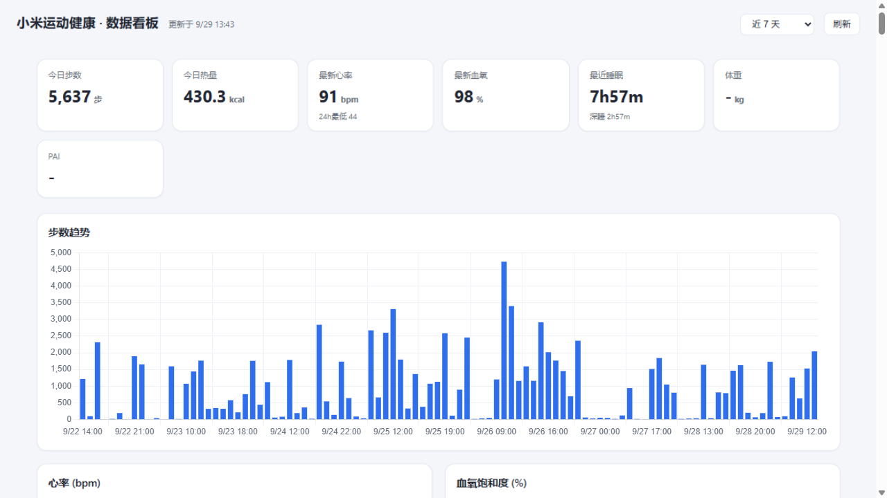

# mihealth-api

小米运动健康（`com.mi.health`，Mi Fitness）云端健康数据 API — 逆向实现。

通过还原 App 内部接口的认证与加密协议，调用其云端服务获取个人健康数据。

[](LICENSE)
[](#)

## 用途

为需要访问**本人**小米运动健康云端数据的场景提供可编程通道：个人数据备份与导出、接入自建项目/仪表板、与第三方工具（Home Assistant、Obsidian、Grafana 等）做数据集成、接口逆向研究与学习。

- 仅供访问**使用者自己账号**名下的数据；需先在登录态设备上提取凭据（见下文）
- 与小米公司无任何关联，不是官方开放 API（官方通道为 `pv.hlthopen.io.mi.com`，需注册 OAuth client_id）
- 请遵守适用法律与平台条款使用



---

## 能力

| 类别 | 内容 |
|---|---|
| 分钟级数据 | 步数、卡路里、心率、血氧、压力、强度活动、站立、耳机噪声 |
| 周期数据 | 睡眠（深睡/浅睡/REM 分期）、PAI、VO2 Max、体重、经期 |
| 医疗/项目 | ECG 等医疗记录、睡眠节律、睡眠日记 |
| 运动 | 记录列表（配速/心率/轨迹）、汇总、类别表 |
| 摘要 | 每日目标达成（步数/热量/活动/站立 达成率） |
| 统计/增量 | `daily_fitness` 统计、watermark 增量锚点 |
| 其它 | 亲友数据、登录态刷新、第三方授权通道 |

- 17 种数据键（CloudKey 全集）× 30+ 端点 × 全量历史翻页
- 交付三件：Python 客户端、Flask HTTP 网关、Web 看板
- 凭证隔离：`config.json` 已 `.gitignore`，不进版本库

## 快速开始

```bash
pip install -r requirements.txt

# 放入凭据（提取方法见 API.md §1）
cp config.example.json config.json

# 命令行试跑
python mihealth_client.py

# HTTP 网关 + 看板 → http://127.0.0.1:8567
python server.py

# （可选）全量导出 → export/*.json
python tools/export_all.py
```

## 凭据提取

在已登录小米账号的 rooted 设备/模拟器上：

```bash
adb shell su -c "sqlite3 /data/data/com.mi.health/app_webview/Default/Cookies \
  'select host_key,name,value from cookies'"
```

| 字段 | 位置 |
|---|---|
| `serviceToken` | `sts-hlth.io.mi.com` 行（长串） |
| `cUserId` | 同一行 |
| `ssecurity` | `.wear.mi.com.internal.yrn.net` 行 |

`.hlth.io.mi.com` 行的 `serviceToken` 值为 `miothealth`，是 sid 标记，不参与认证。

## HTTP API（本地网关）

`server.py` 启动后 `http://127.0.0.1:8567`：

| 路由 | 说明 |
|---|---|
| `GET /` | 数据看板 |
| `GET /api/overview` | 今日摘要 |
| `GET /api/series/<key>?hours=24` | 指定键时间序列 |
| `GET /api/fitness/<key>?start=&end=` | 分钟级数据，`start<=0` 拉全量 |
| `GET /api/daily_goals?days=14` | 每日目标达成 |
| `GET /api/sport_records?days=` `/api/sport_summary` | 运动记录/汇总 |
| `GET /api/medical` `/api/project` `/api/stat/<key>` `/api/aggregated` | 医疗/项目/统计/聚合 |
| `GET /api/watermark/<key>` `/api/max_watermark` | 增量锚点 |
| `GET /api/latest?keys=` `/api/relatives/<sub>` `/api/raw/<path>` `/api/keys` | 最新/亲友/透传/键表 |

响应统一 `{ok, items, count, has_more}`。

## 数据键（17 种）

`steps` `calories` `sleep` `heart_rate` `stress` `spo2` `intensity`
`valid_stand` `energy` `goal` `pai` `blood_pressure` `blood_sugar`
`headset` `weight` `vo2_max` `menstruation`

## 协议还原

```
nonce       = b64( random(8B) | int32(minutes_since_epoch) )
sessionKey  = b64( SHA256( b64dec(ssecurity) | b64dec(nonce) ) )   # RC4-drop1024
data        = b64( RC4(sessionKey, <JSON 参数体>) )
rc4_hash__  = b64( SHA1(METHOD&path&明文kv&sessionKey) ) → 再 RC4 加密
signature   = b64( SHA1(METHOD&path&加密kv&sessionKey) )
_nonce      = nonce
Cookie: cUserId=...; serviceToken=<长token>; locale=zh_cn
```

实测要点：

| 现象 | 结论 |
|---|---|
| `nextKey` 分页无效 | 服务端认 `next_key`（snake_case）；`nextKey` 静默忽略导致同页重复 |
| `startTime=0` + nextKey | 游标冻结重复同页；全量需用近期 startTime + next_key 回溯 |
| `.hlth` cookie `serviceToken=miothealth` | sid 标记；真实 token 在 `sts-hlth` 域 |
| 同分钟多条 | 分页重叠 + 多 sid 源 → 按 `(sid,time)` 去重取最大 |

详见 [API.md](API.md)。

## 目录

```
mihealth_client.py   # Python 客户端 + crypto
server.py            # Flask HTTP 网关（看板 + REST 代理）
static/              # index.html + Chart.js + screenshot.png
tools/               # export_all.py / dump_tokens.js (Frida hook)
API.md               # 接口文档
RECON.md             # 逆向侦查记录
config.example.json  # 凭据模板
```

## 逆向依据

- 样本：`com.mi.health` v3.59.0（13 dex，R8 混淆，无加固）
- 签名链：`com.xiaomi.fitness.app.CloudInterceptor` → `zi4 / di4 / xj4 / ffc / o0l / u82`
- 数据层：`com.xiaomi.fit.fitness.persist.server.FitnessApiService`（host/path/注解）
- 键映射：`CloudKey.getCloudRequestKey`；摘要：`CloudRainbowHelper → daily_fitness/goal`

## License

MIT。仅供个人数据访问与研究用途。
